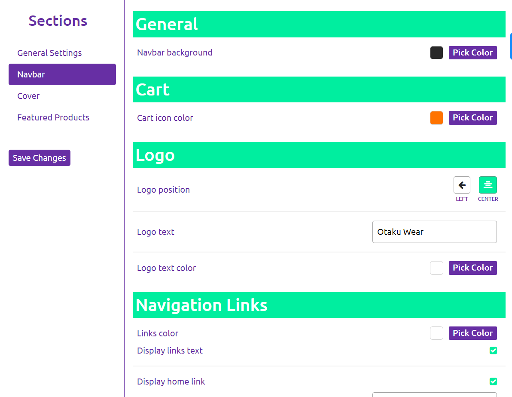
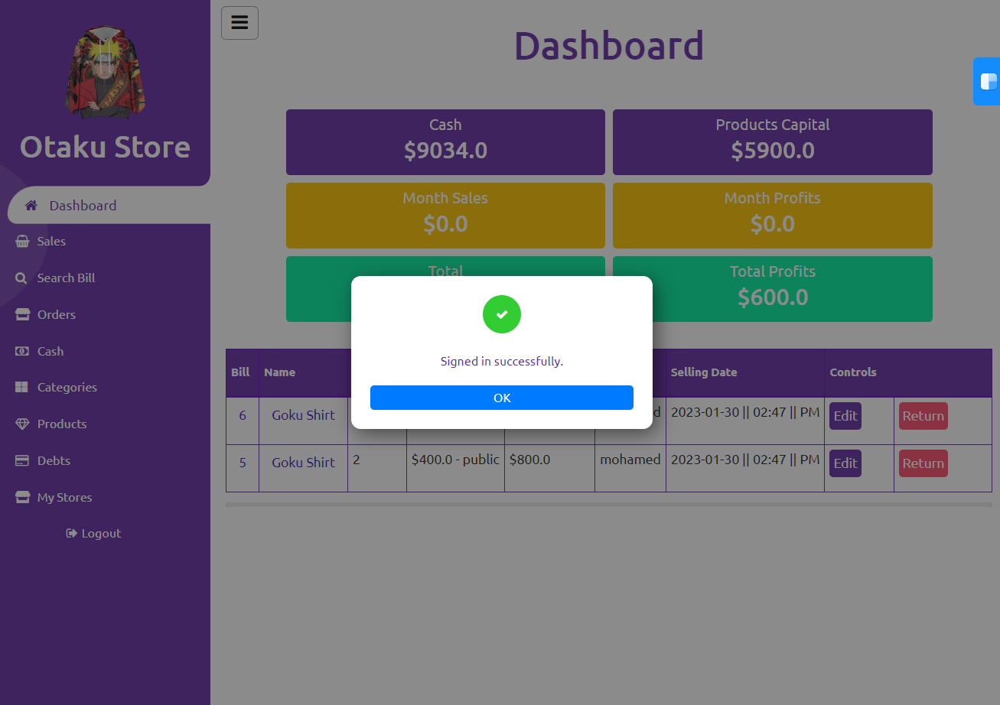
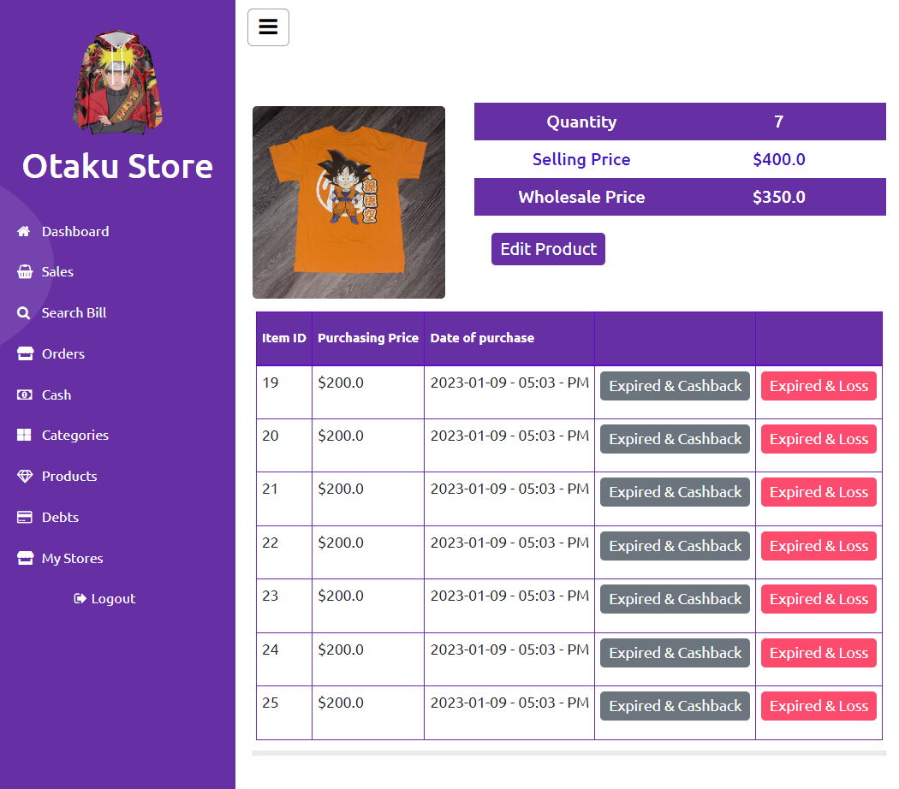
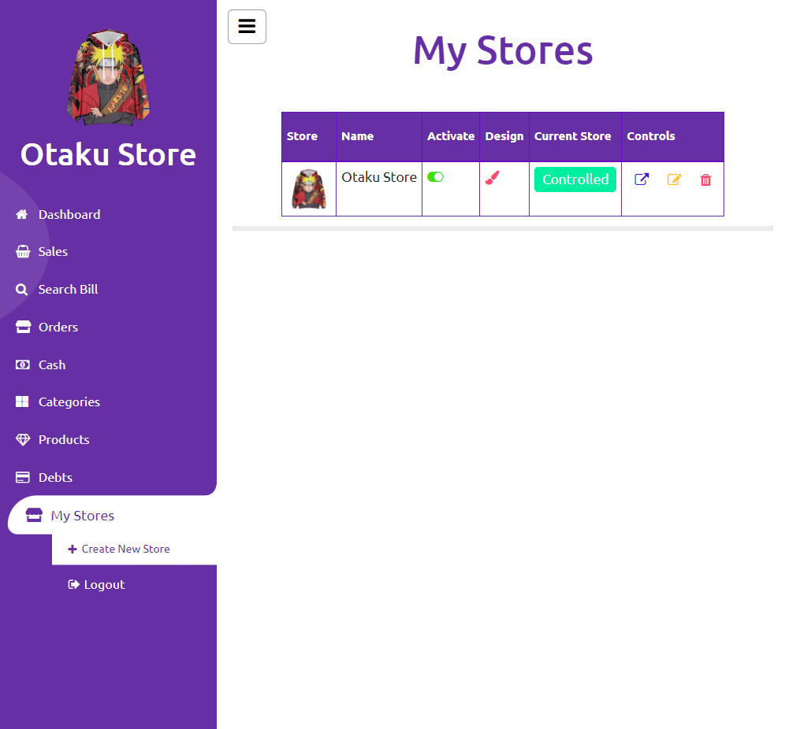

# SellEx Systems

> This project is a full-stack web app built mainly with Rails, React, CSS, and Bootsrap. It is a solution for those who want to manage their community, and online stores at the same time. You can manage:

- Sales and handle returns.
- Products' stock.
- Your cash & products capital.
- Store debts and paying them back.
- Clients' bills.
- Online orders with a simple cart.
- All expenses in income of your store.

<div align="center">






</div>

## Technologies

- Ruby On Rails
- React
- React On Rails
- Cloudinary
- Bootstrap
- CSS
- ES6

## Live Demo

[Live Demo Link](https://sellex.onrender.com/)

## Usage

```
- git clone "https://github.com/Mohamed-js/Sell-Ex.git"
- cd sell-ex
```

## Authors

👤 **Mohammed Atef**

- GitHub: [Mohamed Atef](https://github.com/Mohamed-js)
- Twitter: [@Mohamed Atef](https://twitter.com/Demovejetta)
- LinkedIn: [LinkedIn](https://www.linkedin.com/in/mohamed-js/)

## 🤝 Contributing

Contributions, issues, and feature requests are welcome!

## Show your support

Give a ⭐️ if you like this project!
